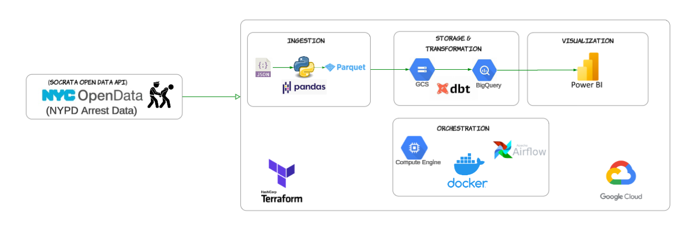
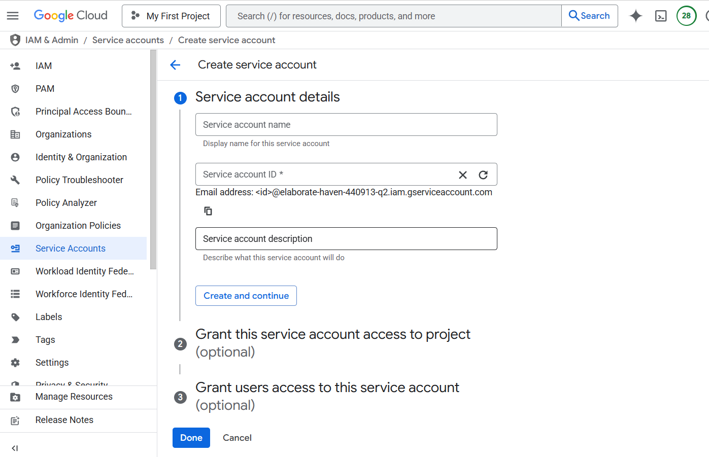

# Analyzing Arrest Data Of NewYork City (Data Engineering Zoomcamp Project) 

This repo contains the project submission for [Data Engineering Zoomcamp](https://github.com/DataTalksClub/data-engineering-zoomcamp/tree/main) Course.


## Dataset
For this project I have used [NYPD Arrests Data (Historic)](https://data.cityofnewyork.us/Public-Safety/NYPD-Arrests-Data-Historic-/8h9b-rp9u/about_data) From [NYC Open Data](https://opendata.cityofnewyork.us/). 
This dataset is a breakdown of every arrest effected in NYC by the NYPD going back to 2006 through the end of the previous calendar year. This data is manually extracted every quarter and reviewed by the Office of Management Analysis and Planning before being posted on the NYPD website. 
Each record represents an arrest effected in NYC by the NYPD and includes information about the type of crime, the location and time of enforcement.

## Problem Statement:
Analyze the NYPD arrest data from 2008-2023 (15 years) to uncover long-term trends and patterns in crime across New York City. The objective is to understand how arrest counts have evolved over time across boroughs, crime categories (felonies, misdemeanors, violations), and demographic groups (age, race, sex).

## Technologies used:
- This project is typically a **batch project**. It involvles the following technologies:
1. Data Ingestion - [Socrata Open Data API(SODA)](https://dev.socrata.com/foundry/data.cityofnewyork.us/8h9b-rp9u)
2. Containerization - Docker (For running Airflow)
3. Orchestration - Airflow
4. IAAC - Terraform
5. Environment to run project - Google Cloud Virtual Machine (VM)
6. Data Warehouse - Google Big Query 
7. Data Transformation - DBT
8. Data Visualization - Power-bi

## Architecture



## Steps to follow:

### General Instruction: 
1. Need to create a Google Cloud Account (free account for first time user with 300$ credits for more info visit this [link](https://cloud.google.com/free/docs/free-cloud-features)). To create one visit this [link](https://k21academy.com/google-cloud/create-google-cloud-free-tier-account/)

2. Before starting with the project we need to set up a Service Account in Google Cloud Platform which would give our applications (like terraform, airflow etc) access to Bigquery, Google Cloud Storage, etc.
To set up service account you follow this [link](https://cloud.google.com/iam/docs/service-accounts-create) for reference.
- Go to GCP.
- Go to IAM Admin (on the right side you can see option for Navigator Bar). 
- Again on Right Side option to create Service Account.
- You also need to create keys, go to Service Accounts --> you will see list of your Service accounts --> look for your account and when you click Actions --> manage keys --> Add key --> Json Key would be downloaded --> store it in proper place and not to show it (we will need this key later). 

- Give access to:
    - Compute Engine Admin
    - BigQuery Admin
    - Storage Admin

3. For this project I also have generate App token on NYC open data portal.
- Go to the dataset with [link](https://data.cityofnewyork.us/Public-Safety/NYPD-Arrests-Data-Historic-/8h9b-rp9u) and then go to Actions --> API --> API documentation --> Under App Token Sign up for an app token --> Under App Token --> Create new App Token (Do not share this and save it in some file).

4. For this project create a new git repository in both local and githhub. 

### 1. Virtual Machine 
- I advice you to do this section later first create terraform code folder and your airflow + docker code folder and then test small part of both the things whether running on local or not and if it works then push the code in your new github repo to run via VM all together.
- #### Instructions to follow:
    1. Creating and adding SSH keys in gcp
    ```bash
    cd .ssh
    ```

    2. Follow the instruction using the link -[gcp create ssh key](https://cloud.google.com/compute/docs/connect/create-ssh-keys)
    ```bash
    ssh-keygen -t rsa -f key-name -C username
    ```

    3. Click Enter for password as well.
    4. 2 keys are created - key-name (private) and key-name.pub (public)
    5. Copy the public gcp key
    ```bash 
    cat publice-key-name.pub
    ```

    6. Now add the copied key to Compute Engine SSH key section (Compute engine --> Settings --> Metadata --> SSH key)
    7. Creating VM instance:
        - On right side tab --> go to VM instance --> name the instance --> choose the nearest region --> select E2 --> E2-standard-4 --> Boot disk : ubuntu,  version - 20.04, Size: 30GB (select) --> Create
    8. To start the instance on your pc, copy external IP of your VM created and write the below code on your cmd prompt
    ```bash
    ssh -i path-to-private-key-name username@external IP
    ```

    9. Download Anaconda - https://anaconda.cloud/api/iam/email/verified/67e53dab-1bac-4d40-9dfd-5a5b3e20365a --> for linux 64-Bit (x86) installer (copy this link)

    ```bash
    # copy link address and then wget paste_link
    wget https://repo.anaconda.com/archive/Anaconda3-2024.10-1-Linux-x86_64.sh

    ls 
    bash Anacond....sh
    ```

    10. Click Enter to continue with services and enter yes and Enter to install.
    11. Open another git bash terminal and then
    ```bash
    cd .ssh

    touch config

    code config 
    ```

    12. In config file past the following
    ```text
    Host vm-instance-name 
        HostName (External IP)
        User user_name
        IdentityFile full_path/.ssh/key-name(private)
        # Save this
    ```

    13. Now you can do 
    ```bash
    cd 
    ssh vm-instance-name
    ```
    14. Back to the terminal of Anaconda installation until now it has been done after this
    ```bash
    less .bashrc

    # logout - login
    ssh vm-instance-name 

    # now u might see like - (base) vm-instance-name
    ```

    15. Configuring Visual Studio code to access remote machine
        - Go to Vs Code - Extension - Remote ssh (first link) - install --> at the bottom there is open a remote window --> Connect to Host (Remote SSH) --> de-zoomcamp
        - Close all ports --> Go to Terminal

    16. Installing docker - follow the below steps

    ```bash
    sudo apt-get update

    # Next install docker
    sudo apt-get install docker.io
    ```

    17. In another terminal git bash, we need to clone our project repo via ssh
    ```bash
    # add the below command first 
    ssh-keygen -t ed25519

    # now
    cd

    #then enter to .ssh
    cd .ssh

    # then check
    ls

    # copy .pub key for ed one
    cat ed...pub

    # paste to git ssh key section 

    # test connection
    ssh -T git@github.com

    git clone link_repo_ssh
    ```

    18. get back to docker terminal, when we run below
    ```bash
    docker run hello-world #throws error - permission denied
    ```
    we need to give permissions to docker.

    19. We need to run cmds w/o sudo follow the step with this [link](https://github.com/sindresorhus/guides/blob/main/docker-without-sudo.md) or below steps given:

    ```bash
    sudo groupadd docker

    sudo gpasswd -a $USER docker

    sudo service docker restart
    # logout - login
    # test
    docker run hello-world

    ```

    20. Next thing is to install docker compose with this [link](https://github.com/docker/compose/releases)
    21. Download docker-compose-linux -x86_64 (copy link address and follow below steps)
    ```bash
    mkdir bin

    cd bin/

    wget link-docker-compose-x86_64 -O docker-compose

    chmod +x docker-compose

    ls # just to check if it became executable

    ./docker-compose version

    # to make it available everywhere instead of bin
    nano .bashrc

    # Type at the very end
    export PATH="${HOME}/bin:${PATH}"
    ```

    -  To get out of the nano --> ctrl + S   --> Ctrll + X
    ```bash
    source .bashrc
    which docker-compose # To see the path

    docker-compose version
    ```

    15. Now, we will open our code file from vm in visual studio code. On left press file logo and select open folder --> select your git project folder.
    16. Installing Terraform--> Linux --> 1.13 --> Amd64, click the [link](https://developer.hashicorp.com/terraform/install)
    ```bash
    cd bin/
    wget link
    sudo apt-get install unzip
    unzip terraform...
    rm terraform.zip
    cd
    terraform -version
    cd git-project-folder # --> go to terraform folder and ls
    ```

    17. Now you will be needing `Service account account creds (json)`
    18.  We will use sftp in New git terminal
    ```bash
    # got to the path where key is stored for me it was in keys folder
    cd keys

    sftp vm-instance-name
    mkdir keys
    cd keys
    put key_name_file.json

    # get out of this ctrl + D
    ```
    19. Now recheck in you vm-instance
    ```bash
    ssh vm-instance
    cd keys
    # you will be able to see your key_name_file.json
    ```

    20. Update your terraform variable file key path then
    ```bash
    cd terraform_code_folder
    terraform init
    terraform plan
    terraform apply #yes to create services.

    ```

    21. To  run airflow inside docker again create one more key folder inside your airflow folder
    ```bash
    cd airflow_folder
    mkdir ./keys
    cp /home/username/keys/my_cred.json ./keys/

    # also need to run again few things I commented for safety while commiting in git
    # inside airflow folder
    mkdir -p logs
    echo -e "AIRFLOW_UID=$(id -u)" > .env

    # also inside .env adding api_token (I created for nyc data access).

    # change path in code folder for keys

    docker-compose build

    docker-compose up airflow-init

    docker-compose up -d
    ```

    22. You need to forward port in Visual studio code to 8080 and open in local browser how well it runs. 
    23. After completing the process you can delete the vm-instance.


### 2. Airflow and Docker

### 3. Datawarehouse (Big Query)

### 4. DBT

### 5. Power-bi


