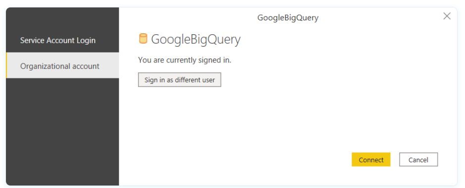
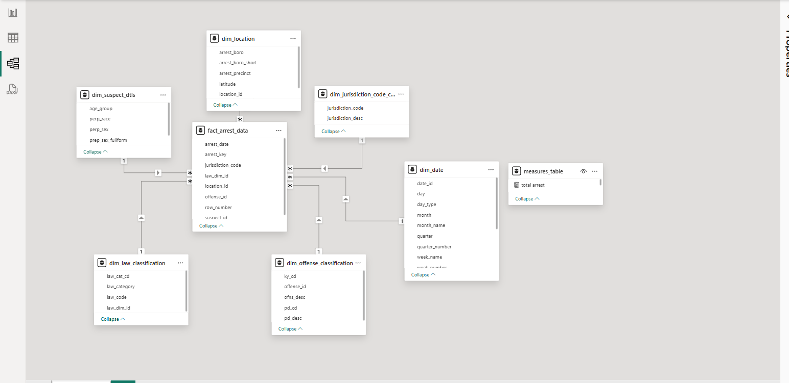

## Dashboard Setup Requirements:

- To view my the dashboard click on this [link](https://www.novypro.com/project/nypd-arrest-data-analysis)

- You need to download power-bi desktop in to local system using this [link](https://www.microsoft.com/en-in/download/details.aspx?id=58494)
- Open power-bi desktop app. Go to Get Data --> Select Google Big Query --> Click Ok to dialogue box --> Select Organazitional account --> Click sign in

- Load all tables from prod and create data model like below.

- Created 4 measures for this dashboard.
1. total arrest = CALCULATE(DISTINCTCOUNT(fact_arrest_data[arrest_key]))
2. total felony arrest = CALCULATE(DISTINCTCOUNT(fact_arrest_data[arrest_key]),dim_law_classification[law_category] = "Felony")
3. total misdemeanor arrest = CALCULATE(DISTINCTCOUNT(fact_arrest_data[arrest_key]),dim_law_classification[law_category] = "Misdemeanor")
4. total violation arrest = CALCULATE(DISTINCTCOUNT(fact_arrest_data[arrest_key]),dim_law_classification[law_category] = "Violation")

- Further you can download the app and then download my file for further reference by clicking this [link](nypd_arrest-data_eng/dashboard/nypd_arrest_data.pbix).
